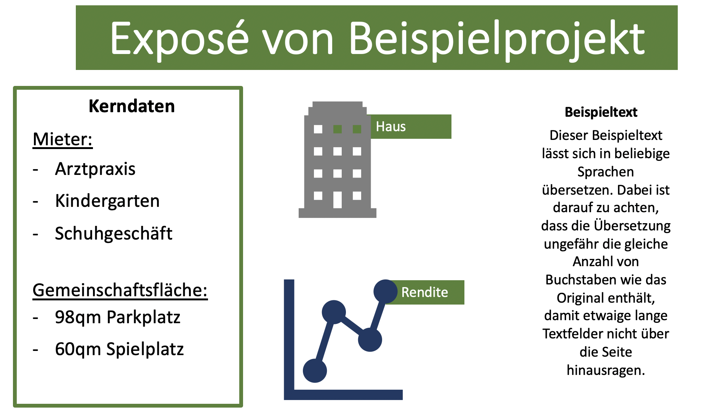
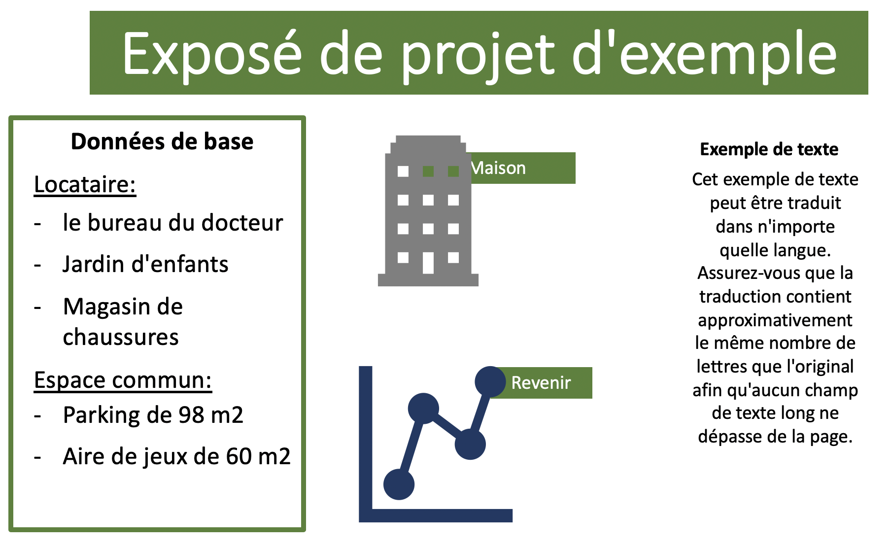

# Prototype to translate PowerPoint files using Google Translate API
Author: Leonard Boes

## Goal: 
For my last employer, we wanted to be able to translate PowerPoint files in an automated manner but also be able to manually edit the translated transcripts. This script creates an Excel file from all text elements in a PowerPoint file and then translates the Excel file using the Google Translate API. The translation is than fed back into the original PowerPoint template, replacing the old text. 

## Important:
When using this code, you will have to create your own file for "GOOGLE_API_KEY.json". For obvious reasons, I will not share my private key to the Google API on Github.

## Example:

The first powerpoint slide automatically gets translated into the predefined language while keeping the style of the presentation

## Future Work:
- Create user interface and upload functionality with Flask
- seperate the steps of creating excel file with original text, translation and pushing translation into original powerpoint template
